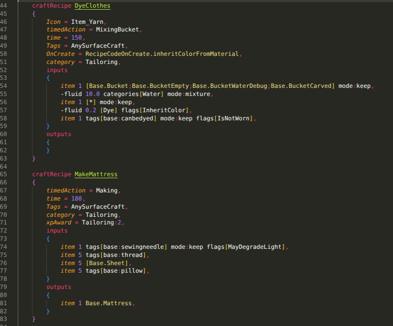
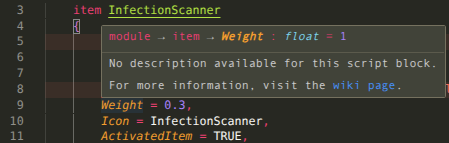
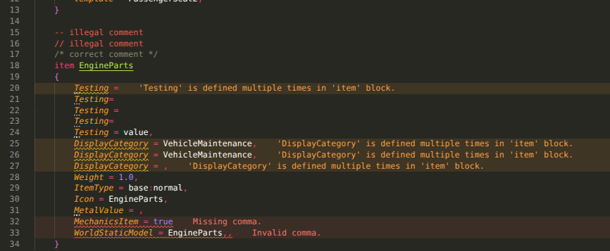

# Project Zomboid VSCode Syntax Extension

This VS Code extension provides comprehensive support for Project Zomboid's [scripts](https://pzwiki.net/wiki/Scripts), also known as ZedScripts, including syntax highlighting, auto-formatting, and diagnostics for items, recipes, and other script blocks. This extension is a fork of [pz-syntax-extension](https://github.com/cyberbobjr/pz-syntax-extension) with a almost complete rewrite and many added features, notably the usage of a common data repository.

> Note: This extension is designed specifically for Build 42.

### Features
- Syntax highlighting for Project Zomboid script files.
- Auto-formatting of script files to maintain consistent style.
- Diagnostics for:
  - Common errors in script definitions;
  - Mandatory, wrong, deprecated parameters;
  - Wrong types and values;
  - Missing commas;
  - And more!
- Hovering tooltips with additional information about script elements.
- Auto-completion for script elements based on the Project Zomboid data (automatic mandatory parameters and subblocks).
- Detection for script blocks used in wrong parent blocks.
- Missing IDs detection.





### Usage
- Install the extension from the VS Code Marketplace.
- Open a `.txt` script file.
- Press Ctrl + Shift + P and select "Change Language Mode".
- Choose "ZedScripts" from the list.

The extension automatically downloads the latest script data from the [pz-scripts-data](https://github.com/SirDoggyJvla/pz-scripts-data) repository and caches it for 12 hours, which it will fetch once more after this time. If it doesn't manage to fetch this data, it will fall back to the bundled data with the extension, which may get outdated until the next update.

You can fetch data manually by running the command "ZedScripts: Force fetch Scripts Data" from the Command Palette (Ctrl + Shift + P). This won't directly update the diagnostics (due to a bug to fix, see [issue #2](https://github.com/SirDoggyJvla/ZedScripts/issues/2)), but you can simply start typing a single character to trigger an update.

### Configuration
By default the Project Zomboid directory is `C:\Program Files (x86)\Steam\steamapps\common\ProjectZomboid\media\scripts`, but you can change this in the settings of the extension. The extension automatically retrieves the vanilla item scripts.

### Contributing
Want to contribute to the project ? Feel free to do so ! You can also help by providing descriptions and data for scripts in the [pz-scripts-data](https://github.com/SirDoggyJvla/pz-scripts-data) repository.

The repository relies on a pre-commit hook to update automatically the singular JSON data file for scripts. To use it, do the following:
1. Clone the repository
2. Create a virtual environment:
   ```bash
   python -m venv .venv
   ```
3. Activate the virtual environment:
   - Linux/Mac: `source .venv/bin/activate`
   - Windows: `.venv\Scripts\activate`
4. Install dependencies:
   ```bash
   pip install -r requirements.txt
   ```
5. Install pre-commit hooks:
   ```bash
   pre-commit install
   ```

This pre-commit hook will make a copy of the singular JSON file from the submodule repository pz-scripts-data into the `src/data` folder before each commit.

### License
This project is licensed under the MIT License. See the LICENSE file for details.
