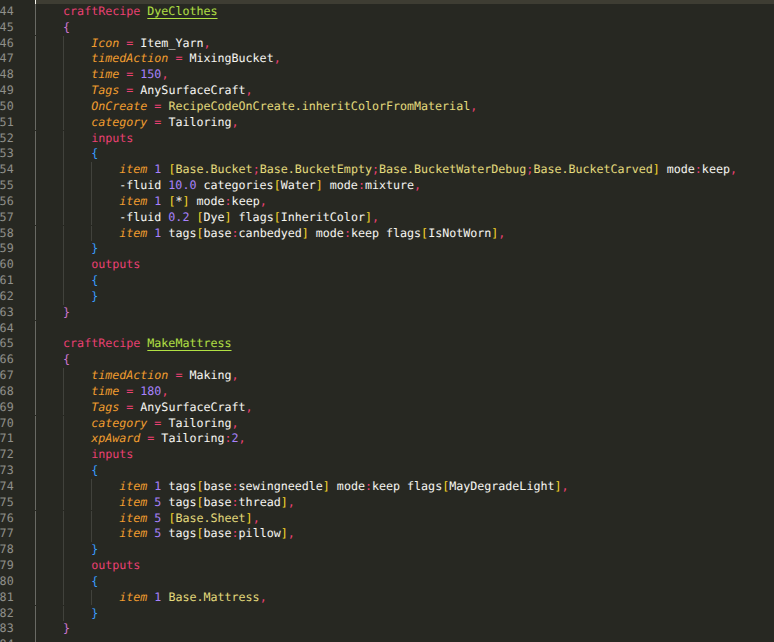
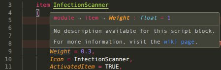
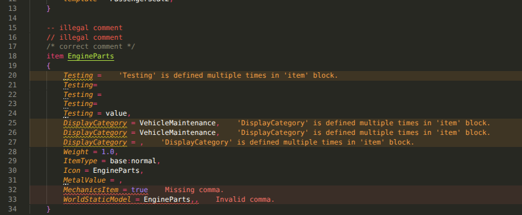
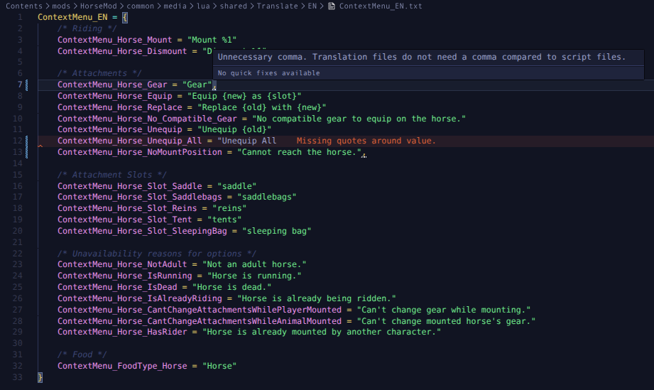

# Project Zomboid VSCode Syntax Extension

This VS Code extension provides comprehensive support for Project Zomboid's [scripts](https://pzwiki.net/wiki/Scripts), also known as ZedScripts, including syntax highlighting, auto-formatting, and diagnostics for items, recipes, and other script blocks. This extension is a fork of [pz-syntax-extension](https://github.com/cyberbobjr/pz-syntax-extension) with an almost complete rewrite and many added features, notably the usage of a common data repository.

> [!NOTE]
> This extension is designed specifically for Build 42.

### Features
#### ZedScripts
- Syntax highlighting for Project Zomboid script files.
- Auto-formatting of script files to maintain consistent style.
- Diagnostics for:
  - Common errors in script definitions;
  - Mandatory, wrong, deprecated parameters;
  - Wrong types and values;
  - Missing commas;
  - And more!
- Hovering tooltips with additional information about script elements.
- Auto-completion for script elements based on the Project Zomboid data (automatic mandatory parameters and subblocks).
- Detection for script blocks used in wrong parent blocks.
- Missing IDs detection.
- Last updated Scripts data via the [pz-scripts-data](https://github.com/SirDoggyJvla/pz-scripts-data) repository, which is automatically fetched every 24 hours and cached.





#### TranslationScripts
> [!WARNING]  
> This feature is now deprecated and only kept for pre-42.15 translation files, as now those use JSON. It will be deleted when the last version supporting pre-42.15 will no longer be supported.
- Translation files syntax highlighting and diagnostics.



### Usage
- Install the extension from the VS Code Marketplace.
- Open a `.txt` script file.
- Press Ctrl + Shift + P and select "Change Language Mode".
- Choose from the list one of the following languages:
  - "ZedScripts" for scripts files
  - "TranslationScripts" for translation files

The extension automatically downloads the latest script data from the [pz-scripts-data](https://github.com/SirDoggyJvla/pz-scripts-data) repository and caches it for 12 hours, which it will fetch once more after this time. If it doesn't manage to fetch this data, it will fall back to the bundled data with the extension, which may get outdated until the next update.

You can fetch data manually by running the command "ZedScripts: Force fetch Scripts Data" from the Command Palette (Ctrl + Shift + P). This won't directly update the diagnostics (due to a bug to fix, see [issue #2](https://github.com/SirDoggyJvla/ZedScripts/issues/2)), but you can simply start typing a single character to trigger an update.

### Configuration
By default the Project Zomboid directory is `C:\Program Files (x86)\Steam\steamapps\common\ProjectZomboid\media\scripts`, but you can change this in the settings of the extension. The extension automatically retrieves the vanilla item scripts. However this is a part of the old code I've yet to touch, so I do not know how well it works.

You can disable a specific diagnostic by adding its ID to the `zedScripts.disabledDiagnostics` setting. Alternatively, you can disable all diagnostics via the `zedScripts.disableAllDiagnostics` setting. Below are all the available diagnostics for scripts:
| ID | Description |
|---|---|
| `MISSING_COMMA` | Missing comma. |
| `INVALID_COMMA` | Invalid comma. |
| `UNMATCHED_BRACE` | Missing closing bracket '}' for '{scriptBlock}' block. |
| `NOT_VALID_BLOCK` | '{scriptBlock}' is an unknown script block. |
| `MISSING_PARENT_BLOCK` | '{scriptBlock}' block must be inside a valid parent block: {parentBlocks}. |
| `HAS_PARENT_BLOCK` | '{scriptBlock}' block cannot be inside any parent block. |
| `WRONG_PARENT_BLOCK` | '{scriptBlock}' block cannot be inside parent block '{parentBlock}'. Valid parent blocks are: {parentBlocks}. |
| `MISSING_CHILD_BLOCK` | '{scriptBlock}' block must have child blocks: {childBlocks}. This might be intentional for soft overrides of an existing block. |
| `MISSING_ID` | '{scriptBlock}' block is missing an ID. |
| `HAS_ID` | '{scriptBlock}' block cannot have an ID. |
| `INVALID_ID` | '{scriptBlock}' block has an invalid ID '{id}'. Valid IDs are: {validIDs}. |
| `HAS_ID_IN_PARENT` | '{scriptBlock}' block cannot have an ID when inside parent block '{parentBlock}', only for: {invalidBlocks}. |
| `UNKNOWN_PARAMETER` | '{parameter}' is an unknown parameter for '{scriptBlock}' block. [WIP: not every parameters are documented yet] |
| `MISSING_PARAMETER` | '{scriptBlock}' block is missing required parameter(s): {parameters}. |
| `DUPLICATE_PARAMETER` | '{parameter}' is defined multiple times in '{scriptBlock}' block. |
| `MISSING_VALUE` | Missing a value. |
| `INVALID_PARAMETER_VALUE` | '{parameter}' has an invalid value '{value}'. |
| `DEPRECATED_PARAMETER` | '{parameter}' parameter in '{scriptBlock}' block is deprecated. |
| `WRONG_VALUE` | '{value}' is not a valid value for parameter '{parameter}'. Valid values are: {validValues}. |
| `INVALID_AMOUNT` | '{amount}' is not a valid amount for '{type}'. |
| `INTEGER_AMOUNT` | '{amount}' should be an integer for '{type}'. |
| `DUPLICATE_PROPERTY` | '{property}' is provided multiple times. |
| `MISSING_ONEOF_PROPERTY` | '{type}' is missing at least one of the following properties: {properties}. |
| `NO_DOTS_ITEM` | An item type (ID) cannot have dots '.' in its name. ({value}) |
| `MISSING_MODULE` | The provided item type (ID) is missing its module part: 'module.type'. ({value}) |
| `ALL_WITH_OTHERS` | '*' was provided along with other item types. '*' must be used alone. |
| `SPACES_IN_ITEM` | An item full type (module and ID) cannot contain spaces. ({value}) |
| `INVALID_VALUE` | '{value}' is not a valid value for '{property}'. Valid values are: {validValues}. |
| `UNMATCHED_CODE` | Unmatched language code between folder name '{folderCode}' and file name '{fileCode}'. They should be the same. |
| `NON_EXISTENT_CODE` | The language code '{code}' does not exist. Valid codes are: {validCodes}. |
| `IN_FIRST_LINE` | Translation key-value pairs cannot be in the first line of the file as it is not parsed. |
| `UNECESSARY_COMMA` | Unnecessary comma. Translation files do not need a comma compared to script files. |
| `INVALID_FILE_PREFIX` | The file '{filePrefix}' is not a valid translation file prefix. Make sure to separate the language code and prefix with an underscore. Valid prefixes are: {validPrefixes}. |
| `MISSING_QUOTES` | Missing quotes around value. |
| `MISSING_PREFIX` | Missing prefix {prefix} for key '{key}'. |

### Contributing
Want to contribute to the project ? Feel free to do so ! You can also help by providing descriptions and data for scripts in the [pz-scripts-data](https://github.com/SirDoggyJvla/pz-scripts-data) repository.

The repository relies on a pre-commit hook to update automatically the singular JSON data file for scripts. To use it, do the following:
1. Clone the repository
2. Create a virtual environment:
   ```bash
   python -m venv .venv
   ```
3. Activate the virtual environment:
   - Linux/Mac: `source .venv/bin/activate`
   - Windows: `.venv\Scripts\activate`
4. Install dependencies:
   ```bash
   pip install -r requirements.txt
   ```
5. Install pre-commit hooks:
   ```bash
   pre-commit install
   ```

This pre-commit hook will make a copy of the singular JSON file from the submodule repository pz-scripts-data into the `src/data` folder before each commit.

### License
This project is licensed under the MIT License. See the LICENSE file for details.

### Changelog

1.9.1:
- properly handle comments /* */ in script files now by replacing them with whitespaces before parsing, which allows to keep the correct character positions for diagnostics and syntax highlighting

1.9.0:
- update to new document files "ROOT-" files from pz-scripts-data
- improved diagnostics for script files by splitting their handling into different document block types. This allows for specific parameters and child blocks to be defined for each document types (sandbox-options.txt, mod.info, generic script files and more)
- now properly detects script files for automatic language activation
- fixed some syntax highlighting and diagnostic issues for script blocks

1.8.1:
- fix missing changelog

1.8.0:
- added a master switch to disable all diagnostics at once
- added ability to disable specific diagnostics via configuration

1.7.1:
- minor handling tweaks for the file activation
- force translation data to use an old copy of the translation data which dates pre-42.15, and force fetch to retrieve from an old copy from the new translation files dataset
